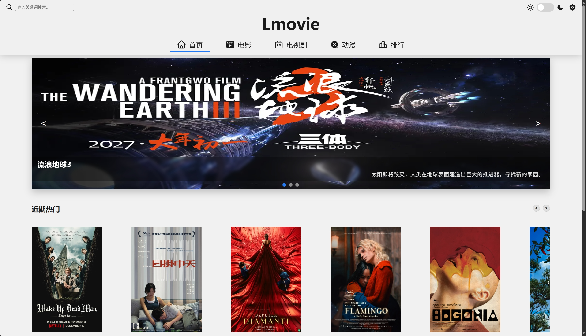
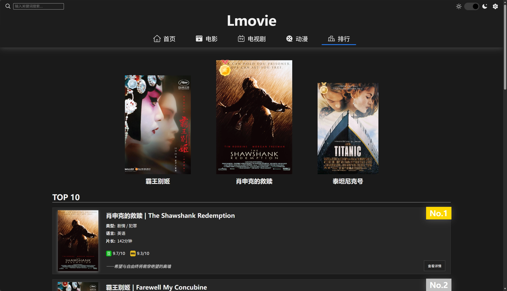
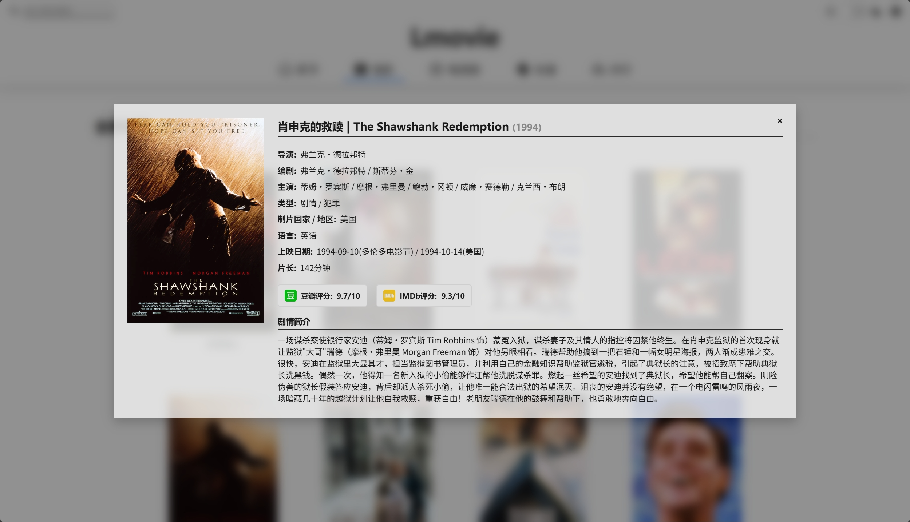

## Lmovie - 影视作品展示平台

- 一个美观、响应式的静态网页项目，用于展示电影、电视剧和动漫作品信息

***
### 网页预览

***
### 功能特性

- 跟随系统深/浅主题，支持手动切换
- 支持影视名称简单模糊搜索
- 轮播图展示热门影视
- 模态框放缩动画
- 适配移动端，平板端，桌面端
- 动态加载内容性能优化

***
### 项目结构

Lmovie/
├── CSS/
│   ├── globalVar.css     # 全局CSS变量和基础样式
│   ├── main.css          # 主页面样式
│   └── naviBar.css       # 导航栏和模态框样式
├── JS/
│   ├── Main.js           # 主逻辑模块
│   └── Data.js           # 影视数据
├── Image/              
│   ├── carousel/         # 轮播图图片
│   ├── main/             # 主页面图标
│   ├── naviBar/          # 导航栏图标
│   ├── poster/
│   │   ├── animat/       # 动漫海报
│   │   ├── movie/        # 电影海报
│   │   └── tvDrama/      # 电视剧海报
└── Lmovie.html           # 主HTML文件

***
### 使用方式

1. 克隆或下载项目文件
2. 直接使用浏览器打开 **Lmovie.html** 

***
### 主要模块说明

**1. 主题管理模块 (themeManagerModule)**

- 自动检测系统主题偏好
- 支持手动切换深色/浅色模式
- 实时更新CSS变量

**2. 页面导航模块 (pageNavigationModule)**

- 五页面切换（首页/电影/电视剧/动漫/排行）
- 动态导航指示器
- 响应式布局适配

**3. 影视数据管理 (mediaDataManager)**

- 管理三大数据库（电影/电视剧/动漫）
- 分页加载机制（初始12条，后续8条）
- 统一的卡片渲染接口

**4. 搜索模块 (searchModule)**

- 实时搜索（300ms防抖）
- 支持中文/国际名称模糊匹配
- 最多显示8个结果

**5. 模态框模块 (movieModalModule)**

- 动态加载影视详情
- 海报点击缩放动画
- 键盘支持（ESC关闭）

**6. 其他功能模块**

- 轮播图自动播放 (carouselModule)
- 近期内容横向滚动 (recentSliderModule)
- 卡片悬停3D效果 (cardHoverModule)
- 返回顶部功能 (backToTopModule)

***
### 自定义配置

#### 修改主题色

- 在globalVar.css中修改

*:root {
    --var-name: color    
}*

#### 调整分页数量

- 在Data.js的mediaDataManger中修改

*pageConfig: {
    initial: 12;
    more: 8
}*

#### 添加新影视数据

1. 在对应的数据库对象中添加新条目
2. 确保包含完整的字段结构
3. 海报图片放置在正确的目录

***
### 声明

- 本项目仅用于学习和展示目的
- 禁止任何形式的商业用途及盈利行为
- 二次开发请保留原始版权声明
- 所有影视数据均来源于豆瓣、IMDb
- 海报图片版权归原影视公司所有
- 若您是版权方，认为本项目涉及内容不妥，请联系我进行修改或移除

***
*最后更新时间：2025-12-19*

*开发者: phosicX* 

***
### 写在最后

- 我是一名本科在读的大二学生，完成这个项目的初衷单纯是对影视和前端的喜爱，既是为了完成期末作业，更是将心中的构想具象化。Lmovie的含义其实很简单，就是Love与movie的结合(LmOViE)。此项目虽然大部分JS逻辑由AI辅助完成，但整体的设计思路、页面布局、交互细节，功能需求都凝聚着我真实的思考与投入，其中还有两位成员填写了大量影视数据，在此表示感谢。所以还请多多包容，有什么建议尽管提出，如果喜欢，欢迎下载欣赏。在下学期，待我学习完前端框架，或许会来重构该项目，并尝试接入服务端与数据库。感谢你能看到这里，愿你我都能与代码一同，不断发展迭代下去。