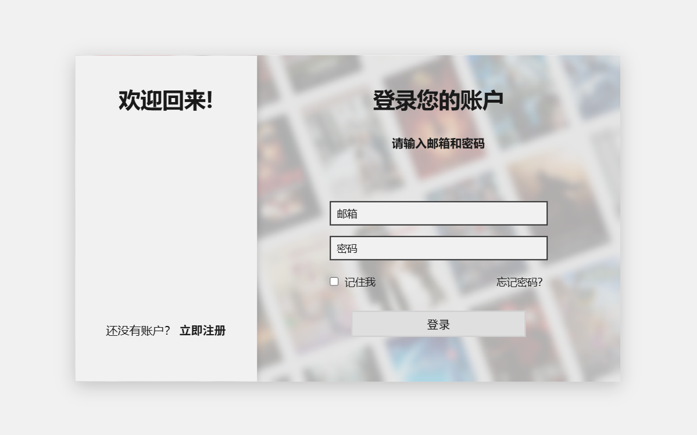

## Lmovie - 影视作品展示平台

- 一个美观、响应式的影视展示平台，提供电影、电视剧和动漫的浏览、搜索和详情查看功能，支持用户注册登录系统。


***
### 网页预览




***
### 项目特色

#### 前端功能
- 跟随系统深/浅主题，支持手动切换
- 支持影视名称简单模糊搜索
- 轮播图展示热门影视
- 模态框放缩动画
- 适配移动端，平板端，桌面端
- 动态加载内容与性能优化

#### 用户系统

- 完整的用户注册/登录功能
- 会话管理（自动登录验证）
- 用户头像和昵称展示
- 安全的密码存储（BCrypt加密）

#### 数据管理

- 后端Java Servlet架构
- MySQL数据库存储
- 影视数据分类管理（电影/电视剧/动漫）
- 支持分页加载和搜索功能


***
### 技术栈

#### 前端
- HTML5 + CSS3（CSS变量、Flexbox、Grid布局）
- JavaScript（模块化、ES6+特性）
- AJAX（异步数据加载）

#### 后端

- Java Servlet（JAKARTA EE）
- JDBC（数据库连接）
- MySQL（数据存储）

#### 工具与库

- Gson（JSON序列化/反序列化）
- JBCrypt（密码加密）
- HikariCP（数据库连接池）
- Maven（项目依赖管理）


***
### 快速开始

#### 1. 环境要求

- Java: JDK 11+
- Web服务器: Tomcat 10+
- 数据库: MySQL 8.0+
- 构建工具: Maven 3.6+

#### 2. 数据库配置
##### 2.1 创建数据库
```mysql
CREATE DATABASE lmovie_db CHARACTER SET utf8mb4 COLLATE utf8mb4_unicode_ci;
```

##### 2.2 导入表结构 *(详见txt表结构)*

##### 2.3 修改数据库连接配置 (DbUtil.java)
```
config.setJdbcUrl("jdbc:mysql://localhost:3306/lmovie_db?useUnicode=true&characterEncoding=UTF-8");
config.setUsername("your_username");
config.setPassword("your_password");
```

#### 3. 项目部署
1. 克隆项目到本地

2. 使用Maven构建：或使用Idea部署（无后续步骤）
    ```bash
    mvn clean package
    
    ```

3. 将生成的WAR文件部署到Tomcat

4. 启动Tomcat服务器

5. 访问：http://localhost:8080/Lmovie/welcome.jsp


***
### API接口说明
#### 用户认证API (/api/auth/*)

- GET /api/auth/check - 检查登录状态
- POST /api/auth/login - 用户登录
- POST /api/auth/register - 用户注册
- POST /api/auth/logout - 退出登录

#### 影视数据API (/api/movies)

- GET /api/movies?type=movie&start=0&limit=12 - 获取电影列表（分页）
- GET /api/movies?type=tv_drama&start=0&limit=12 - 获取电视剧列表
- GET /api/movies?type=anime&start=0&limit=12 - 获取动漫列表
- GET /api/movies?action=detail&id=tt0111161 - 获取影视详情
- GET /api/movies?action=search&keyword=肖申克&limit=10 - 搜索影视


***
### 自定义配置

#### 修改主题色

- 在globalVar.css中修改
    ```css
    :root {
        --var-name: color    
    }
    ```
  
#### 调整分页数量

- 在Data.js的mediaDataManger中修改
    ```javascript
    pageConfig: {
        initial: 12;
        more: 8
    }
    ```

#### 数据库连接池配置

- 在DbUtil.java中调整
    ```
    config.setMaximumPoolSize(20);      // 最大连接数
    config.setMinimumIdle(5);           // 最小空闲连接
    config.setConnectionTimeout(30000); // 连接超时(ms)
    ```
  


***
### 声明

- 本项目仅用于学习和展示目的
- 禁止任何形式的商业用途及盈利行为
- 二次开发请保留原始版权声明
- 所有影视数据均来源于豆瓣、IMDb
- 海报图片版权归原影视公司所有
- 若您是版权方，认为本项目涉及内容不妥，请联系我进行修改或移除


***
*最后更新时间：2026-1-03*

*开发者: phosicX* 


***
### 写在最后
- 啊，谁知道JavaWeb也有期末项目啊，那就正好连接一下后端吧。目前还有很多功能未完善（因为要交作业了），现在已经是期末周了，后续完善时间待定。
- 后续计划完善移动端登录页适配，优化登录页那一坨海报背景，完善用户中心，引入管理员、用户角色，添加收藏功能，升级前端框架...